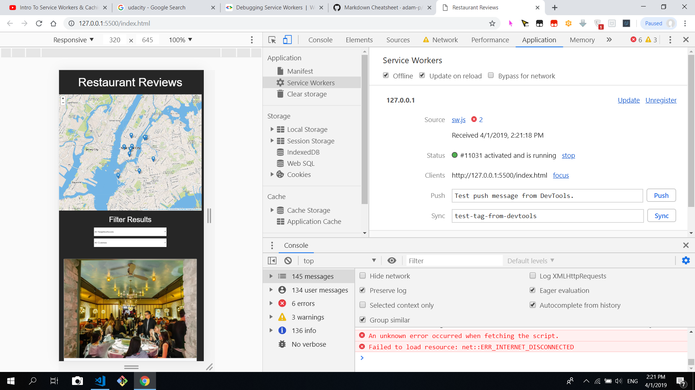
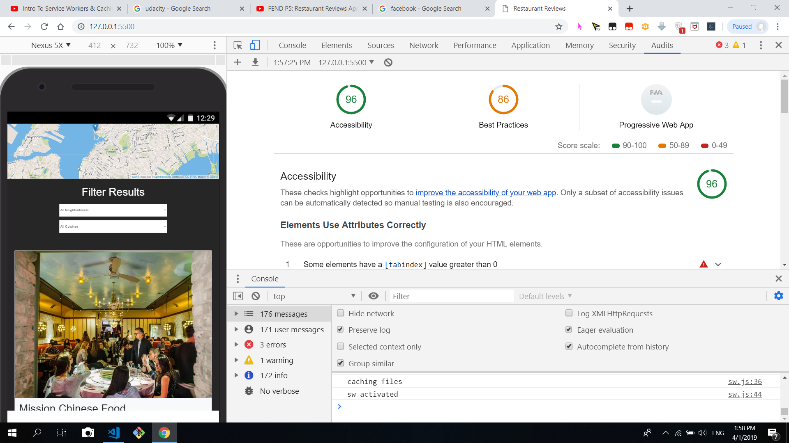

# Restaurant Reviews
---

case study for turning application that is not accessible and not responsive on all
screens to accessible , responsive and offline first app.
 

####  accessibility
---
1. making use of tab index and aria labels to ensure no key traps in any page
2. tested using chrome [vox] (https://chrome.google.com/webstore/detail/chromevox/kgejglhpjiefppelpmljglcjbhoiplfn?hl=en) screen readers 
3. using alt attributes for images

####  responsiveness
---
1. using [bootstrap 4 ](https://getbootstrap.com/) 
2. using [css and bootstrap 4 media query] (https://getbootstrap.com/docs/4.3/layout/overview/)
3. using chrome emulator to test on different viewports

### offline first
---
1. using [service workers] (https://developers.google.com/web/ilt/pwa/caching-files-with-service-worker)
2. using cache api to cache assets
3. tested with [chrome dev tools] (https://developers.google.com/web/fundamentals/codelabs/debugging-service-workers/)
4. tested with case of throtting as well offline

offline: 

### audits
---
the image below shows the audits results

audits: 

##### maps api
---
1. using [mapbox](https://www.mapbox.com/install/) 